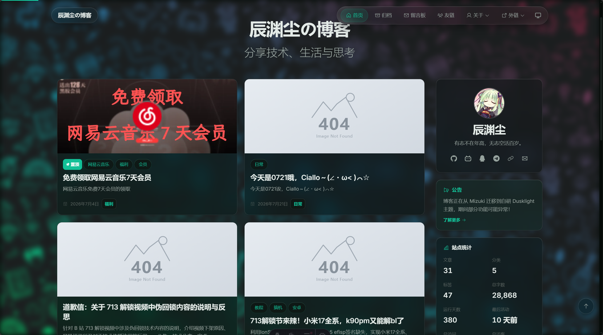
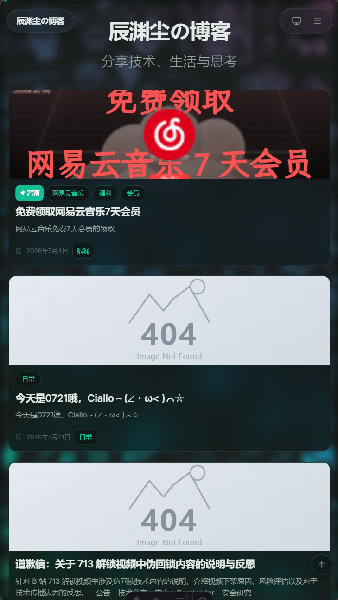

# Dusklight

一个基于 [Astro](https://astro.build) 的个人博客主题，采用液态玻璃设计系统，支持 light / dark / auto 三档主题切换。

[](LICENSE)
[](https://astro.build)




## 特性

- 🪟 **液态玻璃 UI** — `backdrop-filter` 磨砂效果 + 边缘折射高光
- 🌗 **三档主题** — light / dark / auto，带圆形 clip-path 切换动画（View Transitions API）
- 📝 **MDX 支持** — Expressive Code 双主题语法高亮、行号、可折叠区块、语言徽章
- 🏷️ **内容集合** — 类型安全的 frontmatter（标签、分类、阅读时间、置顶、加密）
- 💬 **评论系统** — Twikoo 集成，主题感知样式，View Transitions 兼容
- 📱 **响应式** — 移动端浮动药丸导航 + 侧边抽屉菜单
- ⚡ **纯静态** — 零运行时框架（无 React/Vue/Svelte），极致性能
- 🔍 **SEO** — sitemap、RSS、Atom、Open Graph、JSON-LD 结构化数据
- 🎨 **图标系统** — Phosphor Icons + Simple Icons（astro-icon，tree-shaken）
- 🔒 **文章加密** — 前台密码保护，客户端解密
- 🛡️ **反镜像保护** — 构建期混淆，非授权域名自动重定向
- 📊 **访问统计** — Umami 集成（可配置开关）

## 快速开始

### 前置要求

- Node.js >= 22.12.0
- pnpm（推荐）

### 安装

```bash
# 克隆仓库
git clone https://github.com/mcxiaochenn/Dusklight.git
cd Dusklight

# 安装依赖
pnpm install

# 启动开发服务器（使用内置 demo 内容）
pnpm dev
```

浏览器打开 `http://localhost:4321` 即可预览。

### 配置你的站点

所有站点配置集中在 `src/config/` 目录：

| 文件 | 用途 | 必改项 |
|------|------|--------|
| `site.ts` | 站点标题、URL、功能开关 | `title`、`site`、`analytics` |
| `profile.ts` | 个人信息、头像、社交链接 | `name`、`avatar`、`socials` |
| `nav.ts` | 导航菜单、社交链接 | 按需调整 |
| `comment.ts` | Twikoo 评论系统 | `envId` |
| `seo.ts` | SEO 默认值、搜索引擎验证 | 按需调整 |

设计系统的核心变量在 `src/styles/tokens.css`：

```css
--hue: 170;              /* 改这一个数字，全站配色跟着变 */
--glass-blur: 24px;      /* 液态玻璃模糊强度 */
--content-width: 680px;  /* 正文最大宽度 */
```

### 使用私有内容仓库

博客文章可以放在独立的私有仓库中（与主题框架分离）：

```bash
# 复制环境变量模板
cp .env.example .env

# 编辑 .env，填入你的内容仓库地址
# ENABLE_CONTENT_SYNC=true
# CONTENT_REPO_URL=https://github.com/你的用户名/你的内容仓库.git

# 同步内容并启动
pnpm dev
```

不配置 `.env` 时自动使用仓库内置的 demo 内容。

### 构建与部署

```bash
pnpm build      # 生成 dist/
pnpm preview    # 本地预览构建产物
```

部署到 GitHub Pages 只需在仓库 Settings → Pages 中选择 GitHub Actions 源，推送即自动部署。

## 项目结构

```text
src/
├── components/
│   ├── common/      # Header, Footer, ThemeToggle, BackToTop, SiteBackdrop
│   ├── blog/        # PostCard, TOC, TwikooComments, Encryptor
│   ├── seo/         # SEOHead, JsonLd
│   ├── sidebar/     # ProfileCard, Announcement, SiteStats, Calendar
│   └── ui/          # Button, Tag, Card, Pagination
├── config/          # 所有站点配置（site, profile, nav, comment, seo）
├── content/         # 内置 demo 文章（被私有仓库同步覆盖）
├── data/            # 友链、设备、技能等静态数据
├── layouts/         # BaseLayout（全局壳）、BlogPost（文章详情）
├── pages/           # 路由（首页分页、文章、标签、归档、关于…）
├── plugins/         # remark/rehype 插件（Mermaid、KaTeX、自定义组件）
└── styles/          # 设计 token、玻璃态、排版、动画
```

## 内置功能页面

| 路径 | 页面 |
|------|------|
| `/` | 首页（分页文章流 + 侧栏） |
| `/posts/<slug>/` | 文章详情（TOC、评论、FAB） |
| `/archive/` | 归档 |
| `/tags/` | 标签索引 |
| `/about/` | 关于 |
| `/link/` | 友链（分组卡片墙 + 朋友圈摘要） |
| `/anime/` | 追番（Bilibili API 构建期拉取） |
| `/timeline/` | 开发日志（git log） |
| `/rss.xml` | RSS 2.0 订阅 |
| `/atom.xml` | Atom 1.0 订阅 |

## Mermaid 图表

构建时通过 Playwright（Chromium）渲染 Mermaid 代码块为 SVG。CI 已自动安装，本地需要：

```bash
npx playwright install --with-deps chromium
```

## License

[MIT](LICENSE)
